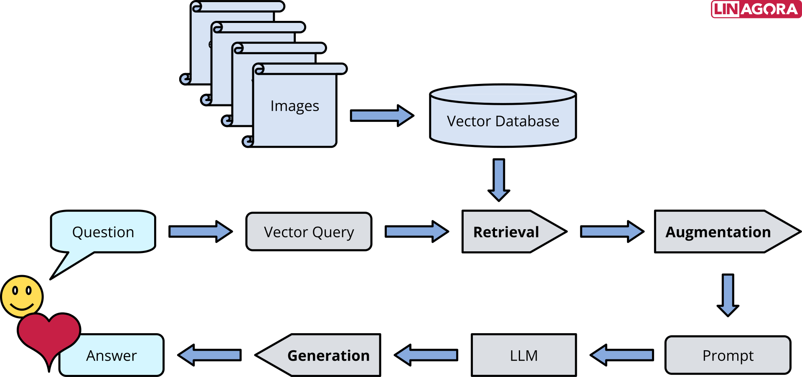

# 🦫 OpenRag — The Open RAG Experimentation Playground



OpenRag is a lightweight, modular and extensible Retrieval-Augmented Generation (RAG) framework designed to explore and test advanced RAG techniques — 100% open source and focused on experimentation, not lock-in.

> Built by the Linagora, OpenRag offers a sovereign-by-design alternative to mainstream RAG stacks.

## Table of Contents
- [🦫 OpenRag — The Open RAG Experimentation Playground](#-openrag--the-open-rag-experimentation-playground)
- [Table of Contents](#table-of-contents)
- [🎯 Goals](#-goals)
- [✨ Key Features](#-key-features)
- [🚧 Coming Soon](#-coming-soon)
- [🚀 Installation](#-installation)
  - [Prerequisites](#prerequisites)
  - [Installation and Configuration](#installation-and-configuration)
  - [Configuration](#configuration)
- [🔧 Troubleshooting](#-troubleshooting)
- [🤝 Contributing](#-contributing)
- [📜 License](#-license)


## 🎯 Goals
- Experiment with advanced RAG techniques
- Develop evaluation metrics for RAG applications
- Collaborate with the community to innovate and push the boundaries of RAG applications

## ✨ Key Features
### 📁 Rich File Format Support
OpenRag supports a comprehensive range of file formats for seamless document ingestion:

* **Text Files**: `txt`, `md`
* **Document Files**: `pdf`, `docx`, `doc`, `pptx` - Advanced PDF parsing with OCR support and Office document processing
* **Audio Files**: `wav`, `mp3`, `mp4`, `ogg`, `flv`, `wma`, `aac` - Audio transcription and content extraction
* **Images**: `png`, `jpeg`, `jpg`, `svg` - Vision Language Model (VLM) powered image captioning and analysis

All files are intelligently converted to **Markdown format** with images replaced by AI-generated captions, ensuring consistent processing across all document types.

### 🎛️ Native Web-Based Indexer UI
Experience intuitive document management through our built-in web interface.

<details>

<summary>Indexer UI Features</summary>

* **Drag-and-drop file upload** with batch processing capabilities
* **Real-time indexing progress** monitoring and status updates
* **Partition management** - organize documents into logical collections
* **Visual document preview** and metadata inspection
* **Search and filtering** capabilities for indexed content

</details>

### 🗂️ Partition-Based Architecture
Organize your knowledge base with flexible partition management:
* **Multi-tenant support** - isolate different document collections

### 💬 Interactive Chat UI with Source Attribution
Engage with your documents through our sophisticated chat interface:

<details>

<summary>Chat UI Features</summary>

* **Chainlit-powered UI** - modern, responsive chat experience
* **Source transparency** - every response includes relevant document references
</details>


### 🔌 OpenAI API Compatibility
OpenRAG API is tailored to be compatible with the OpenAI format (see the [openai-compatibility section](docs/api_documentation.md#-openai-compatible-chat) for more details), enabling seamless integration of your deployed RAG into popular frontends and workflows such as OpenWebUI, LangChain, N8N, and more. This ensures flexibility and ease of adoption without requiring custom adapters.

<details>

<summary>Summary of features</summary>

* **Drop-in replacement** for OpenAI API endpoints
* **Compatible with popular frontends** like OpenWebUI, LangChain, N8N, and more
* **Authentication support** - secure your API with token-based auth

</details>


### ⚡ Distributed Ray Deployment
Scale your RAG pipeline across multiple machines and GPUs.
<details>

<summary>Distributed Ray Deployment</summary>

* **Horizontal scaling** - distribute processing across worker nodes
* **GPU acceleration** - optimize inference across available hardware
* **Resource management** - intelligent allocation of compute resources
* **Monitoring dashboard** - real-time cluster health and performance metrics

See the section on [distributed deployment in a ray cluster](#5-distributed-deployment-in-a-ray-cluster) for more details

</details>

### 🔍 Advanced Retrieval & Reranking
OpenRAG Leverages state-of-the-art retrieval techniques for superior accuracy.

<details>
s
<summary>Implemented advanced retrieval techniques</summary>

* **Hybrid search** - combines semantic similarity with BM25 keyword matching
* **Contextual retrieval** - Anthropic's technique for enhanced chunk relevance
* **Multilingual reranking** - using `Alibaba-NLP/gte-multilingual-reranker-base`

For more details, [see this file](docs/features_in_details.md)

</details>


## 🚧 Coming Soon
* **📂 Expanded Format Support**: Future updates will introduce compatibility with additional formats such as `csv`, `odt`, `html`, and other widely used open-source document types.
* **🔄 Unified Markdown Conversion**: All files will continue to be converted to markdown using a consistent chunker. Format-specific chunkers (e.g., for CSV, HTML) are planned for enhanced processing.
* **🤖 Advanced Features**: Upcoming releases will include Tool Calling, Agentic RAG, and MCP to elevate your RAG workflows.
* **Enhanced Security**: Ensures data encryption both during transit and at rest.

## 🚀 Installation

### Prerequisites
- **Python 3.12** or higher recommended
- **Docker** and **Docker Compose**
- For GPU capable machines, ensure you have the NVIDIA Container Toolkit installed. Refer to the [NVIDIA documentation](https://docs.nvidia.com/datacenter/cloud-native/container-toolkit/install-guide.html) for installation instructions.

### Installation and Configuration
#### 1. Clone the repository:
```bash
git clone git@github.com:linagora/openrag.git

# # to clone the repo with the associated submodules
# git clone --recurse-submodules git@github.com:linagora/openrag.git

cd openrag
git checkout main # or a given release
```

#### 2. Create uv environment and install dependencies:
>[!IMPORTANT] 
> Ensure you have Python 3.12 installed along with `uv`. For detailed installation instructions for uv, refer to the [uv official documentation](https://docs.astral.sh/uv/getting-started/installation/#pypi). You can either use `uv` or `pip` (if already available) or `curl`. Additional installation methods are outlined in the [documentation](https://docs.astral.sh/uv/getting-started/installation/#pypi).

```bash
# with pip
pip install uv

# with curl
curl -LsSf https://astral.sh/uv/install.sh | sh
```

```bash
# Create a new environment with all dependencies
cd openrag/
uv sync
```

#### 3. Create a `.env` File
Create a `.env` file at the root of the project, mirroring the structure of `.env.example`, to configure your environment.

##### File Parser configuration 
> For PDF indexing, multiple loader options are available. Set your choice using the **`PDFLoader`** env variable:
  * **`MarkerLoader`** and **`DoclingLoader`** are recommended for optimal performance, especially on OCR-processed PDFs. They support both GPU and CPU execution.
  * For lightweight testing on CPU, use **`PyMuPDF4LLMLoader`** or **`PyMuPDFLoader`**.
    > ⚠️ These do **not** support non-searchable PDFs or image-based content and images are not handled.

Other file formats (`txt`, `docx`, `doc`, `pptx`, audio type files, etc) are pre-configured.

```bash
# This is the minimal settings required.

# LLM
BASE_URL=
API_KEY=
MODEL=
LLM_SEMAPHORE=10 # change with respect to your llm's capabilities

# VLM for image captioning. You can put your LLM here if it's multimodal 
VLM_BASE_URL=
VLM_API_KEY=
VLM_MODEL=
VLM_SEMAPHORE=10

# App
APP_PORT=8080 # forwarded port of the fastapi

# RETRIEVER
CONTEXTUAL_RETRIEVAL=true # see the `### Chunking` section
RETRIEVER_TOP_K=20 # Number of documents to return before reranking

# EMBEDDER
EMBEDDER_MODEL_NAME=Qwen/Qwen3-Embedding-0.6B
EMBEDDER_API_KEY=EMPTY
# VLLM_PORT=8000 forwarded port
# EMBEDDER_BASE_URL=http://vllm:8000/v1

# RERANKER
RERANKER_ENABLED=true
RERANKER_MODEL=Alibaba-NLP/gte-multilingual-reranker-base
RERANKER_TOP_K=5 # Number of documents to return after reranking. increment it for better results if your llm has a wider context window

# Prompts
PROMPTS_DIR=../prompts/example3_en # you can use the fr version of the prompts '../prompts/example3'

# Loaders
PDFLoader=MarkerLoader
MARKER_MAX_PROCESSES=2 # increment if you've enough gpu capacity

# RAY, to better understand the RAY Parameters, see section 5 on RAY
RAY_DEDUP_LOGS=0
RAY_NUM_GPUS=0.1
RAY_POOL_SIZE=1 # increment if you a cluster of machines
RAY_MAX_TASKS_PER_WORKER=6 # Number of tasks per serializer instance
RAY_DASHBOARD_PORT=8265
RAY_RUNTIME_ENV_HOOK=ray._private.runtime_env.uv_runtime_env_hook.hook

# To enable HTTP authentication via HTTPBearer for the api endpoints
AUTH_TOKEN=super-secret-token
```

##### Indexer UI
>[!IMPORTANT]
> Before launching the app, You might want to configure **`Indexer UI` (A Web interface for intuitive document ingestion, indexing, and management.)** following the dedicated guide:
➡ [Deploy with Indexer UI](docs/setup_indexerui.md)

#### 4.Deployment: Launch the app
You can run the application with either GPU or CPU support, depending on your system:

```bash
# Start with GPU (recommended for better performance)
docker compose up --build -d  # Use 'down' to stop

# Start with CPU
docker compose --profile cpu up --build -d # Use '--profile cpu down' to stop it properly
```
> \[!TIP]
> For quick testing on CPU, you can reduce computational load by adjusting the following settings in the **`.env`** file:

```bash
RERANKER_ENABLED=false # to disable ranking which is a costly operation
# If you want to keep then, reduce `RETRIEVER_TOP_K` to 10 or 20 to reduce ranking computation
```
>[!WARNING]
> These adjustments may affect performance and result quality but are appropriate for lightweight testing.

> \[!INFO]
> The initial launch is longer due to the installation of required dependencies.

Once the app is up and running, visit `http://localhost:APP_PORT` or `http:X.X.X.X:APP_PORT` to access via:

1. **`/docs`** – FastAPI’s full API documentation. See [this guide](docs/api_documentation.md) for more details on the endpoints.
2. **`/chainlit`** – [Chainlit chat UI](https://docs.chainlit.io/get-started/overview) to chat with your partitions. To disable it (e.g., for backend-only use), set `WITH_CHAINLIT_UI=False`.

> [!NOTE]
> Chainlit UI has no authentication by default. To enable it, set the following in your `.env`:

```bash
CHAINLIT_AUTH_SECRET=...       # Generate with: uv run chainlit create-secret (or use any random value)
CHAINLIT_USERNAME=Openrag
CHAINLIT_PASSWORD=Openrag2025
```
> \[!IMPORTANT]
> Chat history is **disabled** by default. To store conversations and related data, enable Chainlit’s data persistence layer.

➡ [Enable Chainlit Data Persistence](docs/chainlit_data_persistency.md)


3. If the **`Indexer UI`** (a web interface for easy document ingestion, indexing, and management) is enabled, you can access it at `http://localhost:INDEXERUI_PORT`. See [this guide](docs/setup_indexerui.md) for setup instructions.


#### 5. Distributed deployment in a Ray cluster

To scale **OpenRag** in a distributed environment using **Ray**, follow the dedicated guide:

➡ [Deploy OpenRag in a Ray cluster](docs/deploy_ray_cluster.md)

#### 6. 🧠 API Overview

This FastAPI-powered backend offers capabilities for document-based question answering (RAG), semantic search, and document indexing across multiple partitions. It exposes endpoints for interacting with a vector database and managing document ingestion, processing, and querying. See this document for [detailed overview of our api](docs/api_documentation.md).


## 🔧 Troubleshooting
<details>
<summary>Troubleshooting</summary>

### Error on dependencies installation

After running `uv sync`, if you have this error:

```
error: Distribution `ray==2.43.0 @ registry+https://pypi.org/simple` can't be installed because it doesn't have a source distribution or wheel for the current platform

hint: You're using CPython 3.13 (`cp313`), but `ray` (v2.43.0) only has wheels with the following Python ABI tag: `cp312`
```

This means your uv installation relies on cpython 3.13 while you are using python 3.12.

To solve it, please run:
```bash
uv venv --python=3.12
uv sync
```
### Error with models' weights downloading
While executing OpenRag, if you encounter a problem that prevents you from downloading the models' weights locally, then you just need to create the needed folder and authorize it to be written and executed

```bash
sudo mkdir /app/model_weights
sudo chmod 775 /app/model_weights
```
</details>


## 🤝 Support and Contributions
We ❤️ your contributions!

We encourage you to contribute to OpenRag! Here's how you can get involved:
1. Fork this repository.
2. Create a new branch for your feature or fix.
3. Submit a pull request for review.

Feel free to ask **`questions`, `suggest features`, or `report bugs` via the GitHub Issues page**. Your feedback helps us improve!


## 📜 License

OpenRag is licensed under the [AGPL-3.0](LICENSE). You are free to use, modify, and distribute this software in compliance with the terms of the license.

For more details, refer to the [LICENSE](LICENSE) file in the repository.
